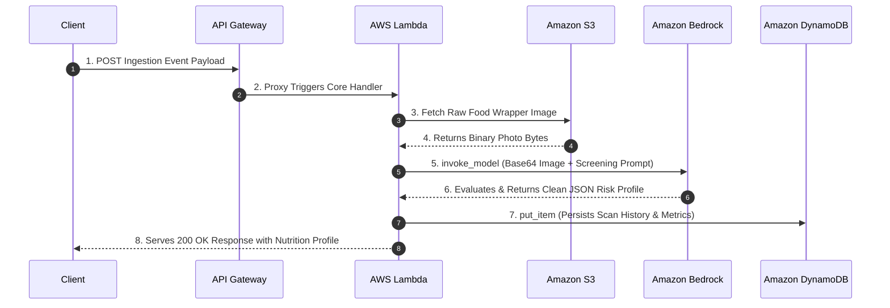

_Amazon API Gateway | AWS Lambda | Amazon S3 | Amazon DynamoDB | Anthropic Claude_


**Overview**
In compliance with government regulations, all packaged food manufacturers are required to print detailed ingredient lists on their product wrappers. However, navigating complex chemical names, hidden allergens, and nutritional jargon makes it incredibly difficult for the average consumer to make informed, healthy choices. Sending every product to a nutritionist for evaluation is slow and impractical.

**The Solution:** Consumers upload a mobile photo of a food wrapper's ingredient label. A serverless AWS architecture leverages a vision-capable Large Language Model (Anthropic Claude via Amazon Bedrock) to instantly analyze the text, evaluate dietary risks, and generate an immediate health risk rating alongside a clear, brief justification.

**Architecture & AWS Components**
This repository implements the solution using the following AWS cloud services:
- **Amazon API Gateway:** Exposes secure REST endpoints to receive the mobile image payloads and user metadata.
- **AWS Lambda:** Serves as the event-driven compute layer to handle image processing, manage backend orchestration, and coordinate database writes.
- **Amazon S3:** Provides secure object storage for original uploaded food wrapper images and compiled PDF nutritional risk reports.
- **Amazon DynamoDB:** Serves as a low-latency, stateless NoSQL datastore to hold user profiles, product barcodes, and historical scan metadata.
- **Amazon Bedrock (Anthropic Claude):** Acts as the foundational AI reasoning engine, utilizing its multimodal capabilities to extract textual ingredient lists from the image and compute precise health risk assessments.

**Key Features**
- **Automated OCR & Vision Analysis:** Eliminates manual text input by reading complex wrapper textures and fonts directly via LLM vision capabilities.
- **Instant Risk Profiling:** Flags high-risk components such as excessive sodium, synthetic additives, or specific user-configured allergens (e.g., gluten, nuts).
- **Serverless Efficiency:** Scales automatically to handle traffic spikes during peak grocery shopping hours and drops to zero idle costs when inactive.
- **Decoupled Performance Auditing:** Features an independent `aws-lambda-power-tuning` implementation to maximize execution velocity while avoiding bloated billing brackets.
---

## System Architecture

The blueprint below visualizes the serverless data orchestration stream, matching your decoupled infrastructure footprint:
Amazon API Gateway: Serves as the secure entry point, accepting image uploads and metadata directly from the user.


AWS Lambda (nutriscan-ingredient-analyzer): The event-driven brain of the operation. It runs on a cost-optimized Arm64 (AWS Graviton) architecture, orchestrating data flow while driving down compute costs.


Amazon Bedrock (Anthropic Claude 3.5 Sonnet): The reasoning core. It processes the image natively via multimodal vision capabilities, eliminating the need for separate complex OCR software.


Amazon DynamoDB & S3: Low-latency state management and secure archival storage for tracking customer history, barcodes, and uploaded images.


---

## Repository Directory Tree

```text
nutriscan-ai-backend/
│
├── .gitignore                  # Safeguards local deployment state maps and locks
├── LICENSE                     # Open-source operational distribution clearances
├── README.md                   # System documentation & architectural runbook
├── requirements.txt            # Explicit backend Python requirements
│
├── code/                       # Serverless core software logic root
│   ├── nutriscan-ingredient-analyzer.py  # Simplified multi-modal orchestrator script
│   └── prompt.txt              # Granular prompt structure utilized by Bedrock
│
└── tf/                         # Infrastructure as Code (IaC) layer
    ├── main.tf                 # Base environment tier (S3, DynamoDB, API GW, Core Lambda)
    ├── variables.tf            # Architectural baseline input schemas
    ├── terraform.tfvars.example # Public baseline placeholder template configuration
    └── test/                   # Isolated optimization workspace directory
        ├── lambda-power-tuning.md # Optimization documentation logs
        ├── power_tuning.tf     # Decoupled SAR CloudFormation Step Function module
        └── power_tuning_asl.json # Amazon States Language configuration file

```

---

## Production Setup & Deployment Blueprint

Follow this step-by-step operational runbook to manually deploy or configure your underlying cloud-native resources:

### 1. Configure the Cloud Storage Vault (Amazon S3)

* Create a globally unique bucket identifier, such as `nutriscan-storage-prod-xyz`.
* Enforce **Block Public Access** settings across the target repository boundary to safeguard uploaded user profiles and photos from unauthorized internet scraping.

### 2. Configure the Fast Metadata Index (Amazon DynamoDB)

* Provision a key-value data table named `nutriscan-scans-prod`.
* Set the primary **Partition Key** to `ScanID` (Type: `String`).
* Enforce **On-Demand billing (PAY_PER_REQUEST)** to ensure pay-per-use scaling and avoid monthly baseline management fees.

### 3. Establish the Identity Access Security Context (AWS IAM)

Create an IAM Custom Execution Role for your computing tier and bind the following exact permissions schema to prevent unauthorized traversal:

```json
{
  "Version": "2012-10-17",
  "Statement": [
    {
      "Effect": "Allow",
      "Action": ["s3:GetObject"],
      "Resource": ["arn:aws:s3:::nutriscan-storage-prod-xyz/*"]
    },
    {
      "Effect": "Allow",
      "Action": ["dynamodb:PutItem"],
      "Resource": ["arn:aws:dynamodb:*:*:table/nutriscan-scans-prod"]
    },
    {
      "Effect": "Allow",
      "Action": ["bedrock:InvokeModel"],
      "Resource": ["arn:aws:bedrock:*::foundation-model/anthropic.claude-3-5-sonnet-20240620-v1:0"]
    }
  ]
}

```

### 4. Deploy the Event-Driven Engine (AWS Lambda)

* Name the compute target `nutriscan-ingredient-analyzer`.
* Set the runtime environment to **Python 3.11** matching the dependencies inside `requirements.txt`.
* Toggle the architecture layout to **Arm64 (AWS Graviton)** to automatically capture a native cost savings advantage over traditional x86 options.
* Adjust the default execution **Timeout to 30 seconds** to accommodate downstream multi-modal token evaluation windows, and verify your environmental path maps point to your live table identity.

---

## LLM Visual Evaluation Engineering Rules

The foundational screening logic utilizes your step-by-step evaluation constraints. It guides Claude to process imagery systematically, avoid formatting hallucination artifacts, and output database-safe attributes:

```text
Analyze the attached image of a packaged food product wrapper ingredient label with these specific steps:

1. Text Extraction & Ingredient Identification: Locate and extract the primary ingredient list by looking for headers like 'Ingredients:', 'CONTAINS:', or regulatory tables.
2. Hidden Allergen Analysis: Scan for primary dietary allergens (gluten, wheat, dairy, nuts, soy, eggs, fish) and facility cross-contamination warnings.
3. Additives & Chemical Screening: Identify synthetic flavor enhancers (MSG), chemical preservatives (benzoate, BHA, BHT), artificial sweeteners, or trans fats.
4. Nutritional Risk Profiling: Flag compounding factors like high-fructose corn syrup, multiple added sugars, or high relative salt/sodium compounds.
5. Health Risk Rating: Assign a rating from 1-4:
   - Rating 1 (Low Risk): Clean label, whole foods, no chemical preservatives or major allergens.
   - Rating 2 (Moderate Risk): Minor processed stabilizers, low added sugar, clearly labeled allergens.
   - Rating 3 (High Risk): Multiple synthetic additives, artificial flavors, chemical preservatives, or corn syrup.
   - Rating 4 (Severe Risk): Heavily laden with artificial chemicals, hydrogenated trans fats, or unlabelled hazards.

Provide your final response structured strictly as a clean JSON block with the following keys: 'ingredients_found', 'health_risk_rating' (the single number from 1-4), and 'brief_justification'. Do not include markdown wrappers or conversation.

```

---

## Performance Benchmarking & Cost Optimization

To balance calculation latency with cloud expenditure, an isolated optimization module is decoupled inside `tf/test/power_tuning.tf`.

This component leverages the official **AWS Lambda Power Tuning** engine pulled from the AWS Serverless Application Repository (SAR). It provisions an automated AWS Step Functions state machine that runs your image processing function across a range of memory tiers (128MB to 4096MB) simultaneously.

### Optimization Input Payload

To benchmark your compute runtime performance under real-world conditions, trigger the state machine using this optimization payload:

```json
{
  "lambdaARN": "arn:aws:lambda:us-east-1:YOUR_ACCOUNT_ID:function:nutriscan-ingredient-analyzer",
  "powerValues": [128, 256, 512, 1024, 1536, 2048, 3072, 4096],
  "num": 10,
  "strategy": "balanced",
  "payload": {
    "body": "{\"bucket\": \"nutriscan-storage-prod-xyz\", \"image_key\": \"raw-images/sample_label.jpg\", \"user_id\": \"tuning_pass_01\"}"
  }
}

```

By observing the generated visualization URL, you can pinpoint the exact intersection point where increasing memory maximizes virtual CPU efficiency (minimizing image base64 processing bottlenecks) without generating excessive billing overages while waiting for model tokens.

---

## Infrastructure Cleanup Routine

To safely remove resource frameworks and drop active billable components to zero when you are done testing, run your teardown workflow in reverse:

1. Purge all raw object photos and output data buffers inside your Amazon S3 bucket instance.
2. Execute your active infrastructure disposal command via your IaC interface terminal:
```bash
terraform destroy -auto-approve

```


3. Verify via the AWS Console that the related Amazon API Gateway REST endpoints, DynamoDB state tracking tables, and CloudWatch retention log groups are completely removed.
